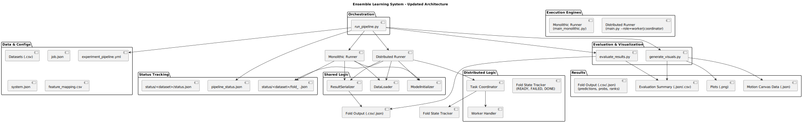

# System Architecture Overview

This document provides a high-level description of the architecture of the Ensemble Learning System. The goal is to support flexible experimentation in both monolithic and distributed environments, while ensuring modularity, reproducibility, and extensibility.

## Diagram

## Key Components

### Orchestration

- `run_pipeline.py`: The orchestrator. It reads the YAML pipeline definition, manages the execution of each phase (train, evaluate, visualize), and coordinates recovery logic using status files.

### Execution Engines

- `main_monolithic.py`: Handles fold-by-fold training in a single process.
- `main.py --role=worker|coordinator`: Entrypoint for the distributed system. Workers train individual folds, and the coordinator assigns tasks and manages fold state.

### Shared Logic

- `DataLoader`: Reads and preprocesses datasets according to the system configuration.
- `ModelInitializer`: Instantiates classifiers and ensemble combinations.
- `ResultSerializer`: Writes predictions, probabilities, and metadata to disk.

### Evaluation & Visualization

- `evaluate_results.py`: Computes metrics from raw fold outputs.
- `generate_visuals.py`: Generates plots or visual content based on evaluation summaries.

### Data & Configuration

- `job.json`, `system.json`, and optional `feature_mapping.csv`: Define how data should be interpreted and processed.

### Status Tracking

All fold/task-level execution is tracked through JSON files under `status/`. These files are used to support reentrancy, resilience, and recovery.

### Results

Each dataset produces structured output in `results/<dataset>/fold_<i>/`, including:
- `predictions.csv`
- `probabilities.csv`
- `ranks.csv`
- `metadata.json`

Summaries and plots are also generated under each dataset's root folder.
