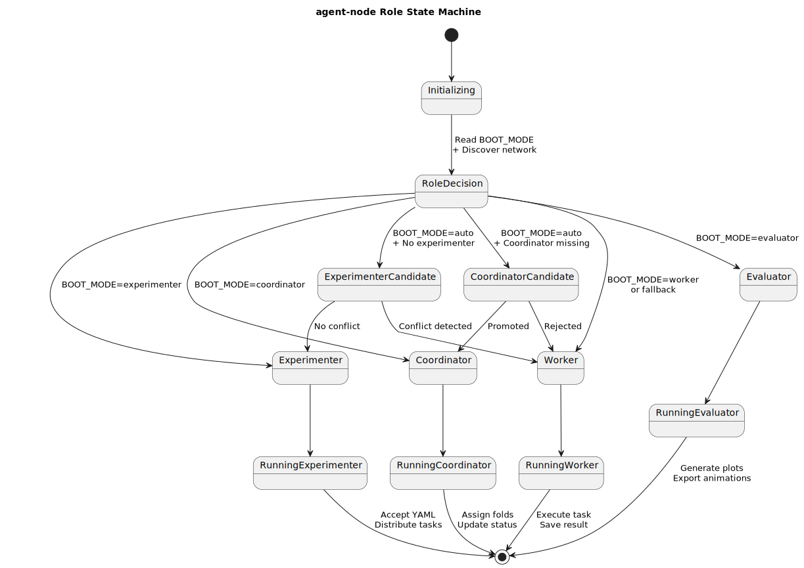

# Dynamic Role Assignment in agent-node

This document explains how each `agent-node` determines its role (e.g., Experimenter, Coordinator, Worker, Evaluator) at startup. Roles are not statically assigned, but instead negotiated dynamically depending on the system state and configuration.

---

## Overview

Each container that runs `agent-node` supports a boot mode that controls its behavior on startup.

### Boot Modes

| Boot Mode        | Description                                                        |
|------------------|--------------------------------------------------------------------|
| `auto` (default) | Node discovers network and chooses role dynamically               |
| `experimenter`   | Forces the node to take ownership of experiment control           |
| `coordinator`    | Acts as a fold distributor for distributed training               |
| `worker`         | Executes individual tasks (train, evaluate, etc.)                 |
| `evaluator`      | Specializes in generating plots and visualizations                |

---

## Role Decision Flow

The following state diagram illustrates how a node determines its role during initialization:

---

## Behavior by Role

### Experimenter
- Accepts `experiment_pipeline.yml` from the Web UI or API.
- Writes tasks to be executed across the network.
- Monitors the state of the system and triggers evaluation/visualization.

### Coordinator
- Only used for distributed training.
- Assigns folds to workers and tracks their progress.
- Can promote itself if no other coordinator is found.

### Worker
- Executes assigned tasks (e.g., training a specific fold).
- Can be promoted to other roles if needed.
- May run multiple tasks in parallel (configurable).

### Evaluator
- Generates metrics, plots, and visualizations.
- Optional but useful for offloading visual processing (e.g., Motion Canvas, D3.js data generation).

---

## Role Negotiation (auto mode)

When running with `BOOT_MODE=auto`, the node performs the following:

1. Detects whether an experimenter already exists on the network.
2. If not, attempts to become experimenter.
3. If one exists, checks if a coordinator is available.
4. If not, promotes to coordinator.
5. Otherwise, defaults to worker.

Fallbacks are safe: the system avoids role duplication and supports recovery after crashes or reboots.

---

## Additional Notes

- Roles are reevaluated if the node detects network changes.
- Nodes can be promoted dynamically during long-running experiments.
- All communication is designed to work across Docker containers and heterogeneous systems.

---
