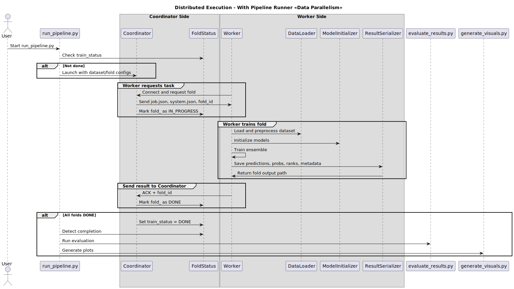

# Distributed Execution Flow

This document explains the coordinator-worker training workflow in distributed mode.

## Diagram

## Description

- `run_pipeline.py` launches the coordinator.
- Workers connect and request tasks.
- The coordinator assigns a fold and configuration.
- Each worker:
  - Loads the dataset.
  - Trains the assigned fold.
  - Saves outputs locally.
  - Notifies the coordinator of completion.
- The coordinator updates the fold status as `DONE`.

Once all folds are completed, the evaluation and visualization steps begin.

## Communication

- Workers receive:
  - `job.json`, `system.json`, `fold_id`
- Workers send:
  - `ACK` and fold output info (or results directly)

## Responsibilities

- **Coordinator**:
  - Manages fold queue
  - Handles assignments and reassignments
  - Updates `status/`

- **Worker**:
  - Performs actual training
  - Writes fold-level results
  - Optionally transmits results back

## Resilience

If a worker crashes or disconnects, the coordinator can reassign its fold.
