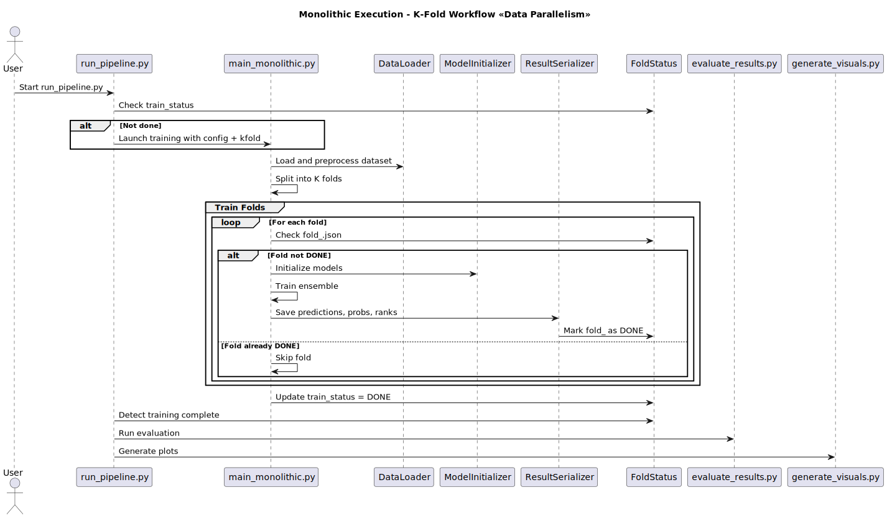

# Monolithic Execution Flow

This document explains the monolithic (single-machine) training flow using `main_monolithic.py`.

## Diagram

## Description

- `run_pipeline.py` calls `main_monolithic.py` with configuration parameters.
- The dataset is loaded and split into K folds.
- For each fold:
  - The fold status file is checked.
  - If not already completed, the fold is trained.
  - Outputs are saved to `results/`, and the fold is marked `DONE`.
- Once all folds are done, the evaluation and visualization phases are triggered by the pipeline.

## Outputs

Each fold produces:
- `predictions.csv`
- `probabilities.csv`
- `ranks.csv`
- `metadata.json`

Stored under: `results/<dataset>/fold_<i>/`
