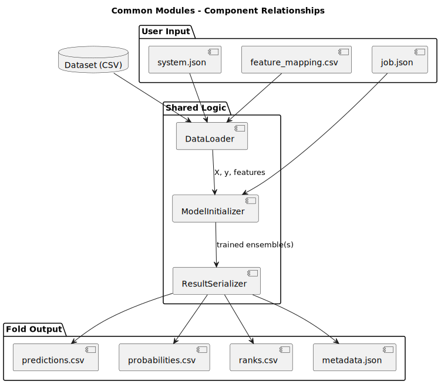

# Common Modules

This document describes the shared modules used by both the monolithic and distributed execution engines. These modules provide the core functionality for loading data, initializing models, and serializing results. They are located in the `src/common/` directory.

---

## 1. DataLoader

### Purpose
Handles reading and preprocessing of datasets according to the definitions in `system.json` and (optionally) `feature_mapping.csv`.

### Responsibilities
- Load CSV files with configurable delimiter and header options.
- Handle missing values, type inference, and feature categorization.
- Apply transformations based on feature types:
  - Numeric
  - Categorical (one-hot encoding)
  - Ordinal (label encoding)

### Inputs
- Path to dataset
- `system.json`
- `feature_mapping.csv` (optional)

### Outputs
- `X`: Preprocessed feature matrix
- `y`: Target labels
- `feature_names`: List of usable features
- Metadata for reproducibility

---

## 2. ModelInitializer

### Purpose
Generates base classifiers and assembles them into ensembles using soft voting.

### Responsibilities
- Instantiate scikit-learn classifiers:
  - Random Forest
  - SVM
  - Naïve Bayes
  - Logistic Regression
  - Others as defined
- Support generation of:
  - Individual base models
  - Random combinations into `VotingClassifier` ensembles
- Seeded for reproducibility

### Inputs
- Model configuration from `job.json`
- Number of models per ensemble
- Number of ensembles to generate

### Outputs
- List of trained (or untrained) ensembles
- Model metadata (names, structure)

---

## 3. ResultSerializer

### Purpose
Stores outputs generated by each fold after training or prediction. Ensures consistent structure for evaluation and visualization.

### Responsibilities
- Write:
  - `predictions.csv`
  - `probabilities.csv`
  - `ranks.csv` (class ranking by confidence)
  - `metadata.json` (fold info, config hash, timestamps)
- Ensure compatibility with evaluator

### Inputs
- Prediction outputs from trained model
- Labels, probabilities
- Target classes
- Output directory

### Outputs
- Files under: `results/<dataset>/fold_<i>/`

---

## Module Diagram

