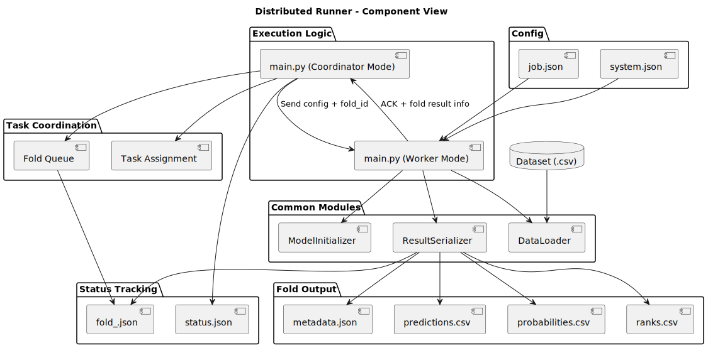
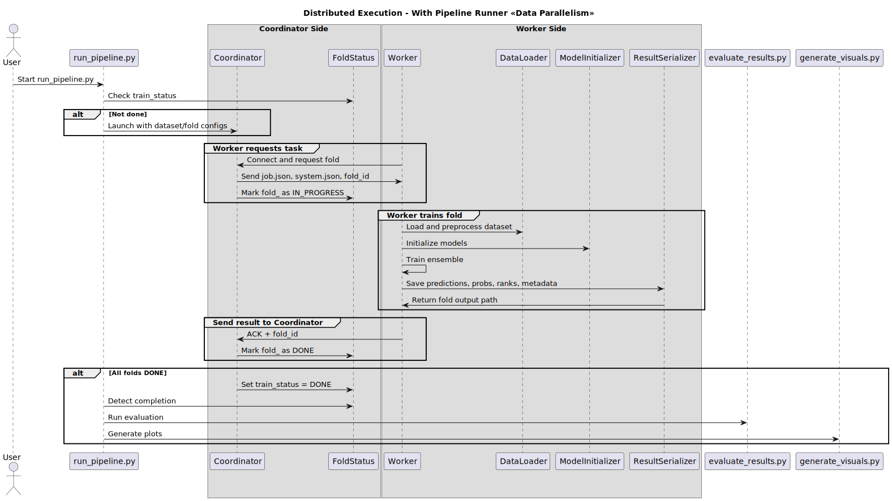

# Distributed Runner Module

This document describes the distributed execution module implemented in `main.py` using the `--role=worker|coordinator` argument. It allows ensemble training to be executed in parallel across multiple devices.

---

## Overview

The distributed runner supports two distinct roles:

- **Coordinator**:
  - Assigns training tasks (folds) to available workers.
  - Manages the global fold status and task queue.
  - Ensures that all results are collected and confirmed.
  - Can be started using: `main.py --role=coordinator`

- **Worker**:
  - Requests a fold to process.
  - Loads the dataset and configuration.
  - Performs training and writes outputs.
  - Sends confirmation back to the coordinator.
  - Can be started using: `main.py --role=worker`

---

## Responsibilities by Role

### Coordinator

- Read all pending tasks from `status/<dataset>/fold_<i>.json`.
- Listen on a socket for worker connections.
- Send configuration and fold ID to each worker.
- Track the status of each fold (`IN_PROGRESS`, `DONE`, `FAILED`).
- Mark `train_status = DONE` in `status.json` when all folds are complete.

### Worker

- Connect to the coordinator.
- Receive:
  - `job.json`, `system.json`
  - Fold ID to process
- Load dataset and config using `DataLoader`.
- Train models using `ModelInitializer`.
- Save results using `ResultSerializer`.
- Send back an ACK to indicate task completion.

---

## Inputs

- Coordinator:
  - `experiment_pipeline.yml`
  - `status/<dataset>/`
- Worker:
  - Receives files and parameters from coordinator at runtime.

---

## Outputs

- Fold results:
  - `predictions.csv`, `probabilities.csv`, `ranks.csv`, `metadata.json`
- Fold status:
  - `status/<dataset>/fold_<i>.json`
- Training status:
  - `status/<dataset>/status.json`

---

## Communication

Communication is done over TCP. Each worker:

1. Connects to the coordinator (by hostname or IP).
2. Sends a task request.
3. Receives:
   - A fold ID
   - Config files (`job.json`, `system.json`)
4. Sends back an ACK when done (optionally with result metadata).

---

## Component Diagram



---

## Execution Flow

See the detailed interaction in the sequence diagram:



---

## Example (CLI)

### Start Coordinator

```bash
python main.py --role=coordinator \
  --config ./data/configurations/iris \
  --results ./results/iris \
  --port 9999
````

### Start Worker (on remote machine)

```bash
python main.py --role=worker \
  --coordinator_host 192.168.1.10 \
  --port 9999
```

---

## Notes

* The coordinator is the source of truth for fold assignment.
* Workers may disconnect and reconnect at any time.
* If a fold fails, it can be reassigned.
* Results must be transferred to a shared location or explicitly returned.
