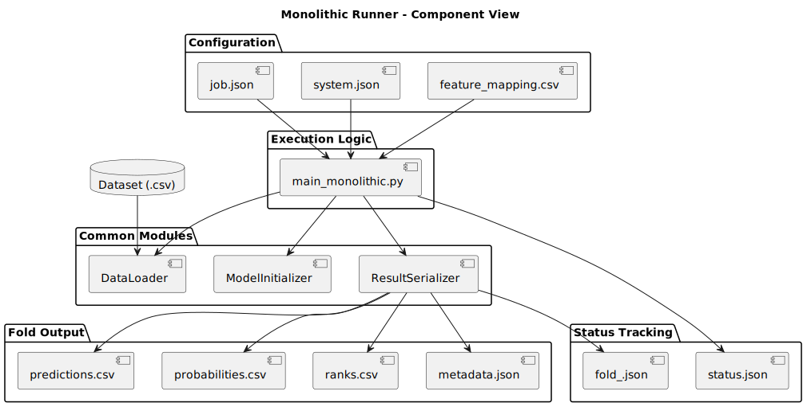

# Monolithic Runner Module

This document describes the monolithic execution module implemented in `main_monolithic.py`. It is responsible for performing ensemble-based classification experiments using a single-machine K-Fold strategy.

---

## Overview

The monolithic runner is used when the system is executed in a standalone mode (i.e., no distributed workers). It handles one dataset at a time, performing training and output generation fold by fold.

The script is typically invoked by `run_pipeline.py`, which determines whether training is required based on the `status/` directory.

---

## Responsibilities

- Load configuration files (`job.json`, `system.json`, and optionally `feature_mapping.csv`).
- Load and preprocess the dataset using `DataLoader`.
- Split the dataset into K folds using `KFold` from scikit-learn.
- For each fold:
  - Check fold status from `status/<dataset>/fold_<i>.json`.
  - If the fold is not already marked as `DONE`, perform training.
  - Save prediction outputs and metadata using `ResultSerializer`.
- At the end, update the global training status in `status/<dataset>/status.json`.

---

## Inputs

- `job.json`: Defines dataset path, model configuration, and output directory.
- `system.json`: Controls preprocessing (e.g., delimiter, header).
- `feature_mapping.csv` (optional): Specifies types of features.
- CLI arguments:
  - `--config`: Path to configuration folder.
  - `--kfold`: Number of folds to run.
  - `--results`: Output root path.

---

## Outputs

- For each fold (`i`), the following files are generated:
  - `predictions.csv`
  - `probabilities.csv`
  - `ranks.csv`
  - `metadata.json`
- Stored under: `results/<dataset>/fold_<i>/`
- Execution status is tracked under: `status/<dataset>/fold_<i>.json`
- The global training status is updated in: `status/<dataset>/status.json`

---

## Interaction with Common Modules

The monolithic runner is composed primarily of calls to shared components:

```plaintext
main_monolithic.py
    ├── DataLoader          → Load dataset and features
    ├── ModelInitializer    → Instantiate ensembles
    └── ResultSerializer    → Save fold outputs
````

---

## Component Diagram



---

## Execution Flow

See the corresponding sequence diagram for a full breakdown of the process:


---

## Example

```bash
python main_monolithic.py \
  --config ./data/configurations/iris \
  --kfold 5 \
  --results ./results/iris
```

This will process 5 folds, skipping any already marked as complete.

