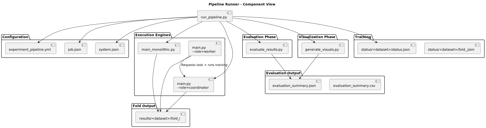
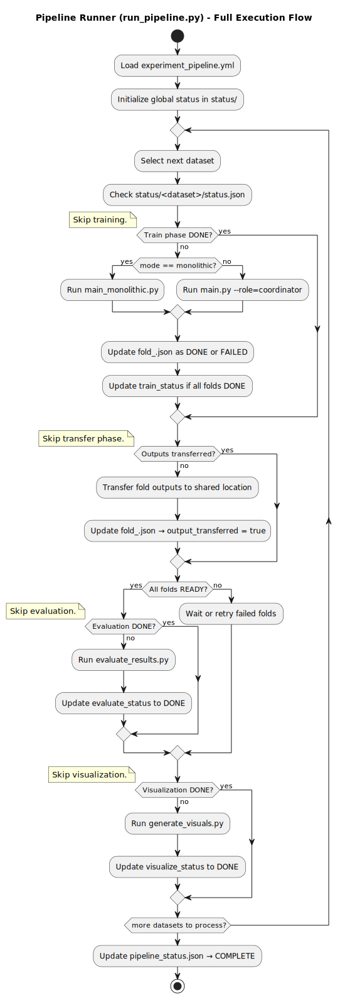

# Pipeline Runner Module (`run_pipeline.py`)

This document describes the behavior and responsibilities of the pipeline controller `run_pipeline.py`. This script orchestrates the entire machine learning experiment workflow across datasets and execution modes.

---

## Purpose

The pipeline runner executes a sequence of steps defined in a YAML file (`experiment_pipeline.yml`). It ensures that training, evaluation, and visualization happen in the correct order and that completed steps are not repeated.

---

## Responsibilities

- Load pipeline configuration and global settings.
- Iterate over datasets and control flow per step.
- Delegate training to the correct execution engine:
  - Monolithic (`main_monolithic.py`)
  - Distributed (`main.py --role=coordinator`)
- Manage recovery:
  - Skip already completed folds or steps using `status/`.
  - Detect failures and allow retry.
- Launch:
  - `evaluate_results.py` once all folds are `DONE`.
  - `generate_visuals.py` once evaluation is complete.

---

## Pipeline Definition

Defined in `experiment_pipeline.yml`. Example:

```yaml
global:
  kfold: 5
  output_root: ./results
  log_level: INFO

datasets:
  - name: iris
    config_path: ./data/configurations/iris
    mode: monolithic

  - name: digits
    config_path: ./data/configurations/digits
    mode: distributed
    coordinator_host: 192.168.0.100

steps:
  - train
  - evaluate
  - visualize
````

---

## Execution Logic

For each dataset:

1. Check `status/<dataset>/status.json`
2. For each step:

   * If the step is already marked as `DONE`, skip it.
   * Otherwise, execute it using the appropriate method:

     * `train` → launch training runner
     * `evaluate` → call `evaluate_results.py`
     * `visualize` → call `generate_visuals.py`

Status is updated per dataset and step.

---

## Input Files

* `experiment_pipeline.yml`
* `job.json`, `system.json` (per dataset)
* Dataset files (`.csv`)

---

## Output Files

* Per-fold outputs under `results/<dataset>/fold_<i>/`
* Evaluation summaries and plots
* Status tracking under `status/<dataset>/`

---

## Component Diagram



---

## Sequence Diagram

See full execution flow:



---

## Example

```bash
python run_pipeline.py --config experiment_pipeline.yml
```

---

## Future Extensions

The current system supports a fixed pipeline of steps (`train`, `evaluate`, `visualize`). However, the architecture is well-suited to support a more flexible and extensible execution model.

This includes:

- Defining custom steps in the YAML pipeline
- Supporting script-based or container-based actions
- Adding distributed evaluation or visualization steps
- Triggering actions based on events (e.g., "all folds ready")

For a complete description of future architectural improvements and extensibility patterns, see:

📄 [docs/architecture/future_work.md](../architecture/future_work.md)
